# Documentation Roadmap

- [System as Is](#system-as-is)
    - [Level 1](#level-1)
        - [Logical View](#logical-view)
        - [Generic System Sequence Diagrams](#generic-system-sequence-diagrams)
    - [Level 2](#level-2)
        - [Logical View](#logical-view-1)
        - [Physical View](#physical-view)
        - [Generic System Sequence Diagrams](#generic-system-sequence-diagrams-1)
    - [Level 3](#level-3)
        - [Logical View](#logical-view-2)
        - [Implementation View](#implementation-view)
        - [Mapping Between Logical and Implementation Views](#mapping-between-logical-and-implementation-views)
    - [Test Health Metrics](#test-health-metrics)

- [Quality Attribute Scenarios (QAS)](#quality-attribute-scenarios-qas)

- [Technical Memos](#technical-memos)

- [System To Be](#system-to-be)
    - [Level 1](#level-1-1)
        - [Logical View](#logical-view-3)
        - [Generic System Sequence Diagrams](#generic-system-sequence-diagrams-2)
    - [Level 2](#level-2-1)
        - [Logical View](#logical-view-4)
        - [Physical View](#physical-view-1)
        - [Generic System Sequence Diagrams](#generic-system-sequence-diagrams-3)
    - [Level 3](#level-3-1)
        - [Logical View](#logical-view-5)
        - [Implementation View](#implementation-view-1)
        - [Mapping Between Logical and Implementation View](#mapping-between-logical-and-implementation-view)
        - [Generic System Sequence Diagrams](#generic-system-sequence-diagrams-4)
    - [Test Health Metrics](#test-health-metrics-1)
    - [Spot Bugs Report Analysis](#spot-bugs-report-analysis)
    - [Critical Pipeline Analysis](#critical-pipeline-analysis)
    - [Tests Comparison: System As Is v.s. System To Be](#tests-comparison-system-as-is-vs-system-to-be)

## System as Is

### Level 1

#### Logical View

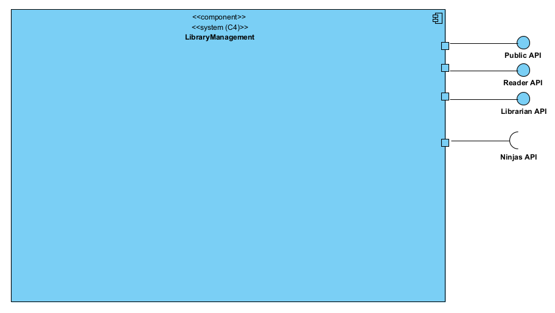

#### Generic System Sequence Diagrams

### Level 2

#### Logical View

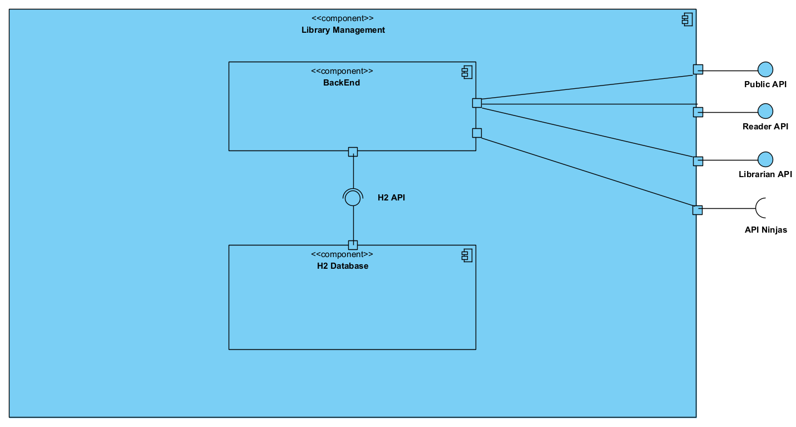

#### Physical View

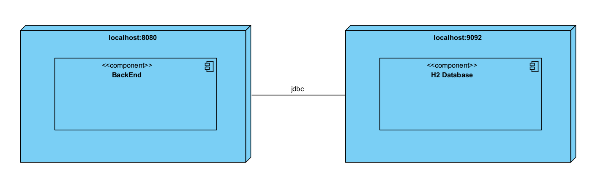

#### Generic System Sequence Diagrams

### Level 3

#### Logical View

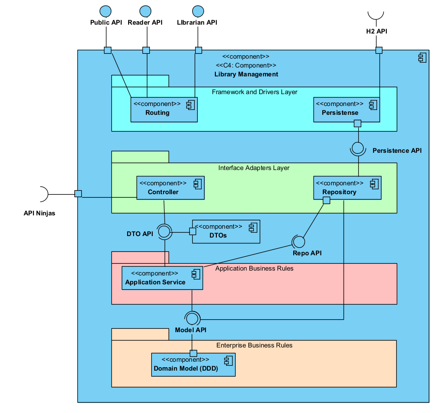

#### Implementation View

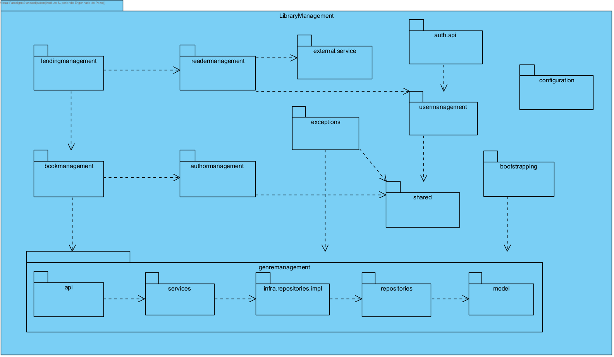

#### Mapping Between Logical and Implementation Views

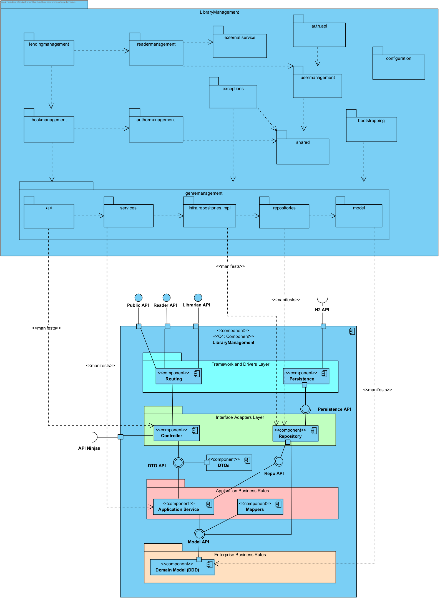

Note: Change Intelli J to the light Theme to see the mapping more clearly

### Test Health Metrics

## Quality Attribute Scenarios (QAS)

## Technical Memos

## System To Be

### Level 1

#### Logical View

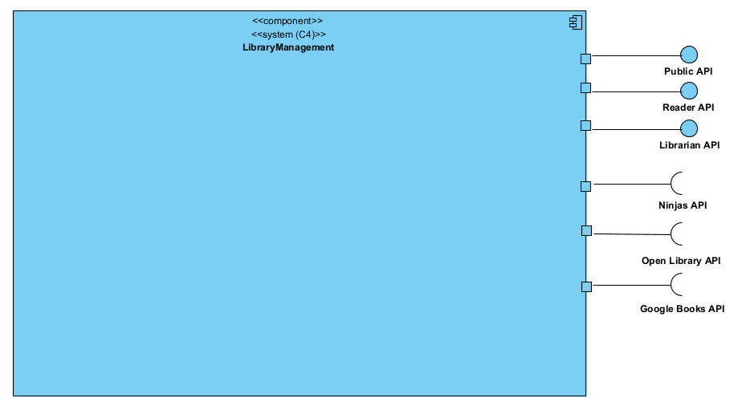

#### Generic System Sequence Diagrams

### Level 2

#### Logical View

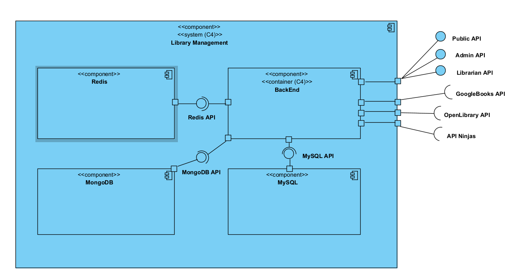

#### Physical View

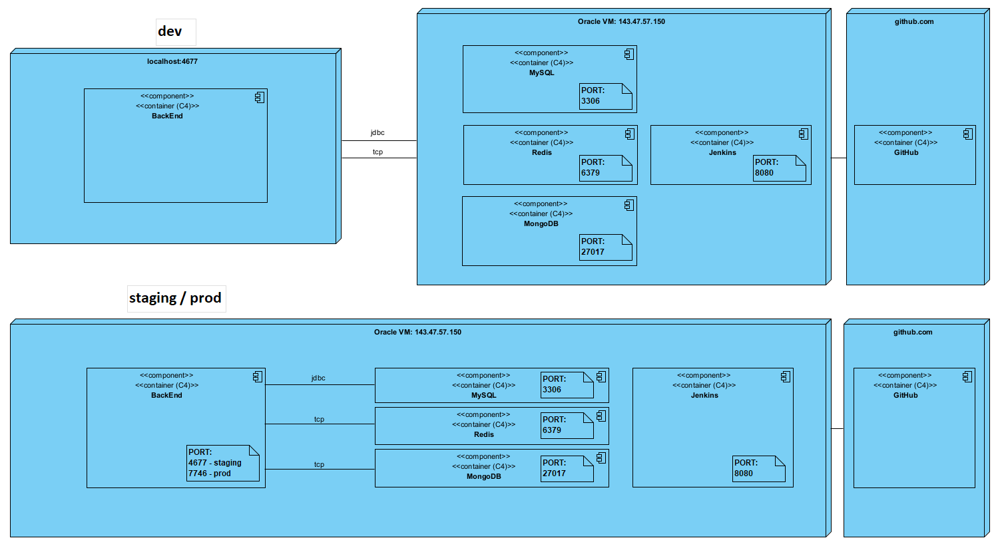

#### Generic System Sequence Diagrams

### Level 3

#### Logical View

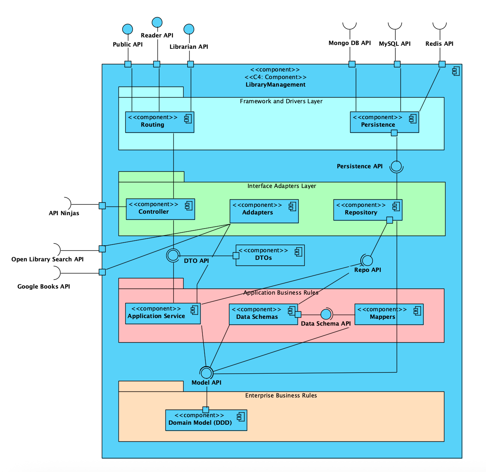

#### Implementation View

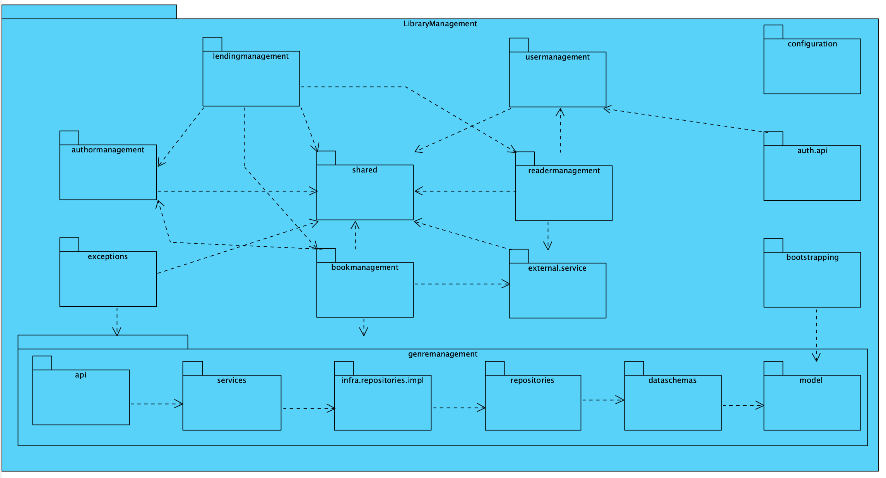

#### Mapping Between Logical and Implementation View

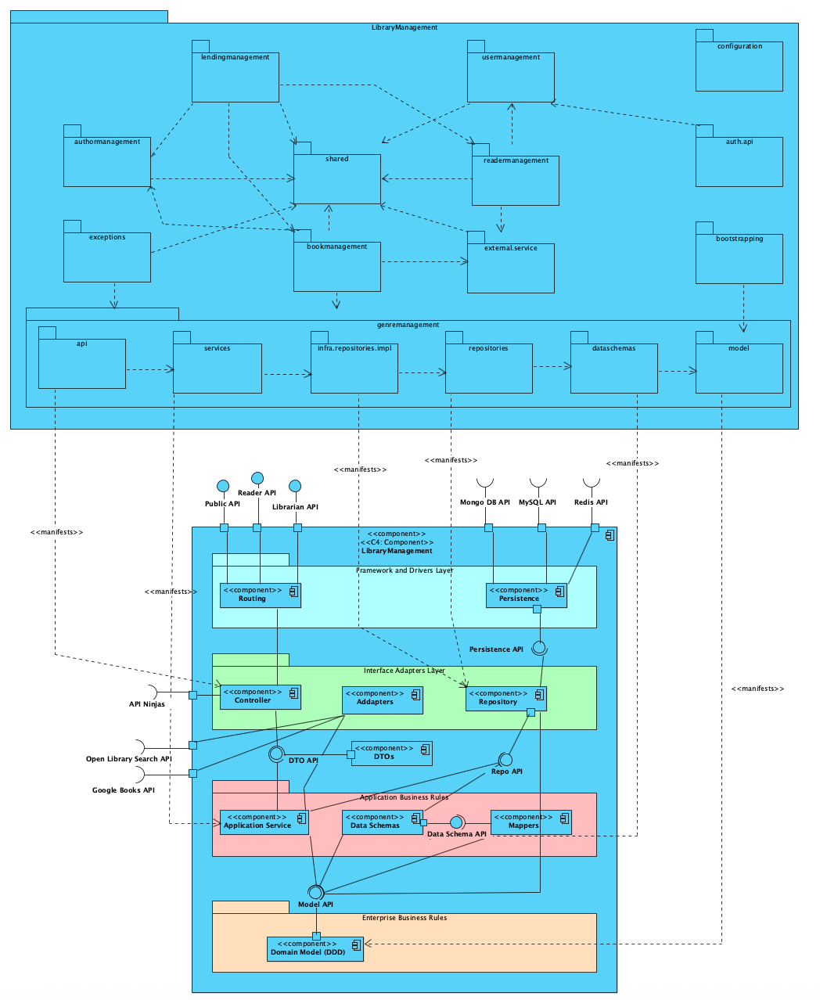

Note: Change Intelli J to the light Theme to see the mapping more clearly

#### Generic System Sequence Diagrams

### Test Health Metrics

### Spot Bugs Report Analysis

### Critical Pipeline Analysis

### Tests Comparison: System As Is v.s. System To Be

