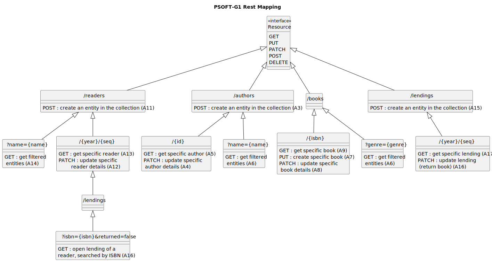

| Method | URI Template                                             | Equivalent RPC operation    | Access                  |                                       
|:-------|:---------------------------------------------------------|-----------------------------|-------------------------|
| POST   | readers                                                  | createReader                | Unauth                  |
| GET    | readers?name={name}                                      | getReadersByName            | Librarian               |
| GET    | readers/{year}/{seq}                                     | getReader                   | Librarian, Reader(Self) |
| PATCH  | readers/{year}/{seq}                                     | updateReader                | Reader(Self)            |
| GET    | readers/{year}/{seq}/lendings?isbn={isbn}&returned=false | getOpenReaderLendingsByIsbn | Reader(Self)            |
| POST   | authors                                                  | createAuthor                | Librarian               |
| GET    | authors?name={name}                                      | searchAuthorsByName         | Librarian, Reader       |
| GET    | authors/{id}                                             | getAuthor                   | Librarian, Reader       |
| PATCH  | authors/{id}                                             | updateAuthor                | Librarian               |
| GET    | books/{isbn}                                             | getBook                     | Librarian, Reader       |
| PUT    | books/{isbn}                                             | createBook                  | Librarian               |
| PATCH  | books/{isbn}                                             | updateBook                  | Librarian               |
| GET    | books?genre={genre}                                      | getBooksByGenre             | Librarian, Reader       |
| POST   | lendings                                                 | createLending               | Librarian               |
| GET    | lendings/{year}/{seq}                                    | getLending                  | Librarian, Reader(Self) |
| PATCH  | lendings/{year}/{seq}                                    | updateLending               | Reader(Self)            |                             |

