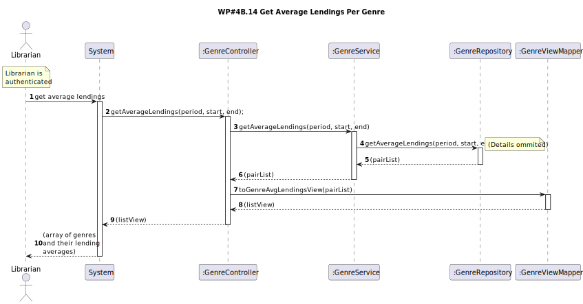
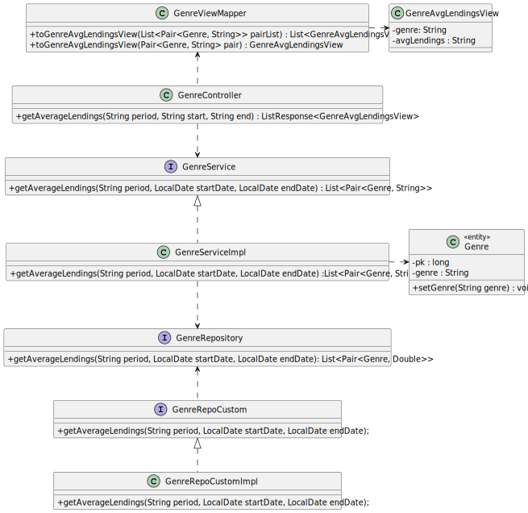

# WP#4A.15 Lend Book
## 1. Requirements Engineering
### 1.1. User Story Description

As Librarian I want to know the average number of lending per genre of a certain month.

### 1.2. Customer Specifications and Clarifications

>[View WP4B](../WP4B-Lendings.md/#12-customer-specifications-and-clarifications)

>[Q: Para esta US, também são incluídos tanto empréstimos em aberto como devolvidos? ](https://moodle.isep.ipp.pt/mod/forum/discuss.php?d=29835#p37841)
>
>A: todos os emprestimos independente do seu estado

>[Q: A média deve contemplar a parte decimal do valor? Se sim, com quantas casas decimais? ](https://moodle.isep.ipp.pt/mod/forum/discuss.php?d=29835#p37841)
>
>A: sim. 1 casa decimal

>[Q:  O que é que é realmente pretendido? A média diária de empréstimos por género num dado mês? Ou a média mensal de empréstimos por género num mês, ao longo de vários anos? ](https://moodle.isep.ipp.pt/mod/forum/discuss.php?d=29835#p37857)
>
>A: Pretende-se saber para esse mês, em média, quantos livros de um dado género foram emprestados por dia


### 1.3. Acceptance Criteria
- Pretende-se saber para esse mês, em média, quantos livros de um dado género foram emprestados por dia

### 1.4. Found out Dependencies
- A Librarian must be logged into the system.
- To get meaningfull data, at least one lending needs to be registered in the requested period.

### 1.5 Input and Output Data

**Input Data:**

* Typed data:
  * Base (day, week, month)
  * Start date
  * End date

**Output Data:**

* Average of number of lendings over a certain period

## 2. OO Analysis
### 2.1. Relevant Domain Model Excerpt


### 2.2. Other Remarks

It was deemed appropriate to make the endpoint as flexible as possible, allowing for different periods of average, and adjustable start and end dates.
## 3. Design
### 3.1. Sequence Diagram (SD)



### 3.2. Class Diagram (CD)



## 4. Tests
### 4.1. Unit Tests


### 4.2. Postman Tests

Valid request:

{{host}}{{baseUrl}}/genres/avgLendings?period=month&start=2024-05-01&end=2024-05-31
```json 
{
    "items": [
        {
            "genre": "Ação",
            "avgLendings": "2,0"
        },
        {
            "genre": "Informação",
            "avgLendings": "1,0"
        },
        {
            "genre": "Romance",
            "avgLendings": "3,0"
        }
    ]
}
```

Invalid request (start date after end date):

{{host}}{{baseUrl}}/genres/avgLendings?period=month&start=2024-06-01&end=2024-05-31
```json
{
    "message": "Bad Request",
    "details": [
        "Start date cannot be after end date"
    ]
}
```
Invalid request (invalid date format):

{{host}}{{baseUrl}}/lendings/genres/avgLendings?period=month&start=2024-26-01&end=2024-05-31
```json
{
    "message": "Bad Request",
    "details": [
        "Expected format is YYYY-MM-DD"
    ]
}
```

Invalid request (invalid period):

{{host}}{{baseUrl}}/genres/avgLendings?period=dia&start=2024-05-01&end=2024-05-31
```json
{
    "message": "Bad Request",
    "details": [
        "Possible average periods - day, week, month, year"
    ]
}
```

Full run:

```json
{
  "id": "55148378-7e2f-49f7-9ee2-f02c7fc49448",
  "name": "Psoft-G1",
  "timestamp": "2024-06-04T18:12:46.708Z",
  "collection_id": "34875941-32bf8340-b0a1-48d5-addc-3322dc75523d",
  "folder_id": "34875941-2807c98b-ee7c-4c49-aec8-27f08751d7be",
  "environment_id": "34875941-db492c2d-9e8e-45d5-a5f4-0b932ddab702",
  "totalPass": 4,
  "delay": 0,
  "persist": true,
  "status": "finished",
  "startedAt": "2024-06-04T18:12:45.884Z",
  "totalFail": 0,
  "results": [
    {
      "id": "4d2e79bd-f5a0-443e-bb75-c48d82ac77ce",
      "name": "GetAverageLendings",
      "url": "http://localhost:8080/api/genres/avgLendings?period=month&start=2024-05-01&end=2024-05-31",
      "time": 40,
      "responseCode": {
        "code": 200,
        "name": "OK"
      },
      "tests": {
        "OK": true
      },
      "testPassFailCounts": {
        "OK": {
          "pass": 1,
          "fail": 0
        }
      },
      "times": [
        40
      ],
      "allTests": [
        {
          "OK": true
        }
      ]
    },
    {
      "id": "5d08ba5d-9e19-487b-a463-d100246ca28b",
      "name": "GetAverageLendings - invalid dates",
      "url": "http://localhost:8080/api/genres/avgLendings?period=month&start=2024-06-01&end=2024-05-31",
      "time": 9,
      "responseCode": {
        "code": 400,
        "name": "Bad Request"
      },
      "tests": {
        "Bad Request": true
      },
      "testPassFailCounts": {
        "Bad Request": {
          "pass": 1,
          "fail": 0
        }
      },
      "times": [
        9
      ],
      "allTests": [
        {
          "Bad Request": true
        }
      ]
    },
    {
      "id": "e2ea0c86-9f53-42a8-b713-f104de928305",
      "name": "GetAverageLendings - invalid date format",
      "url": "http://localhost:8080/api/genres/avgLendings?period=day&start=2024-35-01&end=2024-05-31",
      "time": 9,
      "responseCode": {
        "code": 400,
        "name": "Bad Request"
      },
      "tests": {
        "Bad Request": true
      },
      "testPassFailCounts": {
        "Bad Request": {
          "pass": 1,
          "fail": 0
        }
      },
      "times": [
        9
      ],
      "allTests": [
        {
          "Bad Request": true
        }
      ]
    },
    {
      "id": "b7511028-eeba-4c32-8566-ef85543f7c02",
      "name": "GetAverageLendings - invalid period Copy",
      "url": "http://localhost:8080/api/genres/avgLendings?period=dia&start=2024-05-01&end=2024-05-31",
      "time": 9,
      "responseCode": {
        "code": 400,
        "name": "Bad Request"
      },
      "tests": {
        "Bad Request": true
      },
      "testPassFailCounts": {
        "Bad Request": {
          "pass": 1,
          "fail": 0
        }
      },
      "times": [
        9
      ],
      "allTests": [
        {
          "Bad Request": true
        }
      ]
    }
  ],
  "count": 1,
  "totalTime": 67,
  "collection": {
    "requests": [
      {
        "id": "4d2e79bd-f5a0-443e-bb75-c48d82ac77ce",
        "method": "GET"
      },
      {
        "id": "5d08ba5d-9e19-487b-a463-d100246ca28b",
        "method": "GET"
      },
      {
        "id": "e2ea0c86-9f53-42a8-b713-f104de928305",
        "method": "GET"
      },
      {
        "id": "b7511028-eeba-4c32-8566-ef85543f7c02",
        "method": "GET"
      }
    ]
  }
}
```


## 5. Observations

