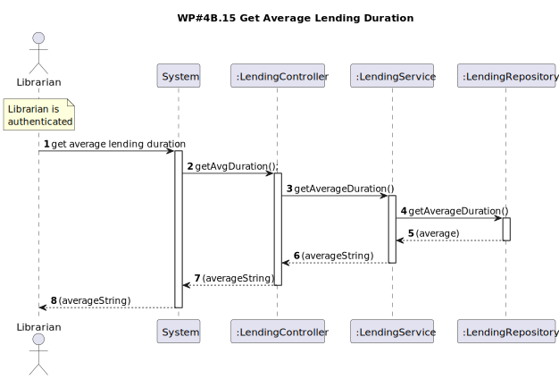
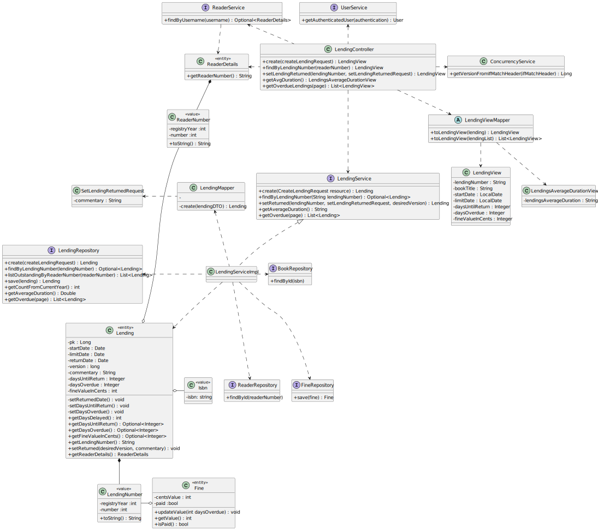

# WP#4A.15 Lend Book
## 1. Requirements Engineering
### 1.1. User Story Description

As Librarian I want to know the Average lending duration.

### 1.2. Customer Specifications and Clarifications

>[View WP4B](../WP4B-Lendings.md/#12-customer-specifications-and-clarifications)

>[Q: Também são incluídos tanto empréstimos em aberto como devolvidos? ](https://moodle.isep.ipp.pt/mod/forum/discuss.php?d=29835#p37841)
>
>A: todos os emprestimos independente do seu estado

>[Q: A média deve contemplar a parte decimal do valor? Se sim, com quantas casas decimais? ](https://moodle.isep.ipp.pt/mod/forum/discuss.php?d=29835#p37841)
>
>A: sim. 1 casa decimal

### 1.3. Acceptance Criteria
- The Librarian is shown the average lending duration
 
### 1.4. Found out Dependencies
- A Librarian must be logged into the system.
- To get meaningfull data, at least one lending needs to be registered.

### 1.5 Input and Output Data

**Input Data:**

* Typed data:
  * NA

**Output Data:**
* Average lending duration

## 2. OO Analysis
### 2.1. Relevant Domain Model Excerpt

### 2.2. Other Remarks
## 3. Design
### 3.1. Sequence Diagram (SD)

### 3.2. Class Diagram (CD)

## 4. Tests
## 5. Observations
