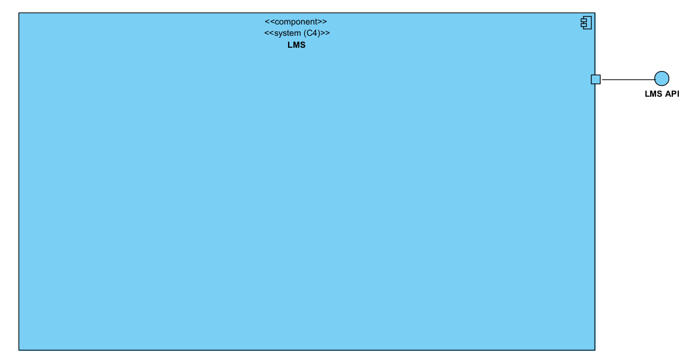
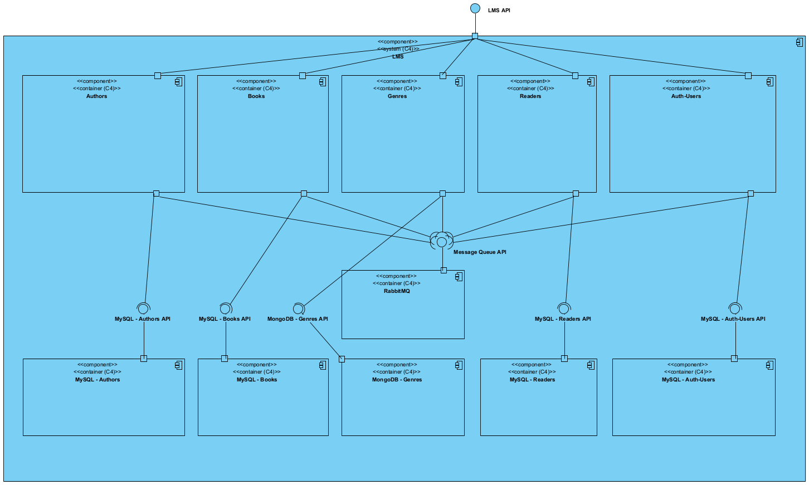
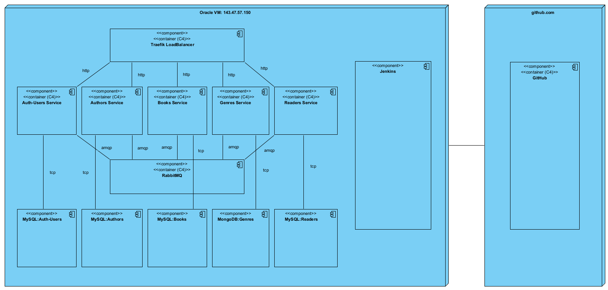
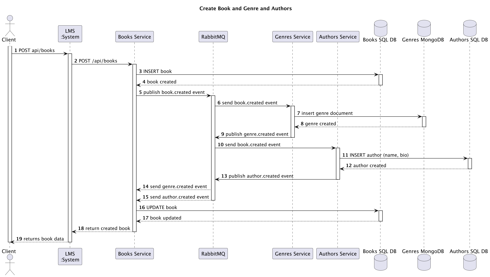
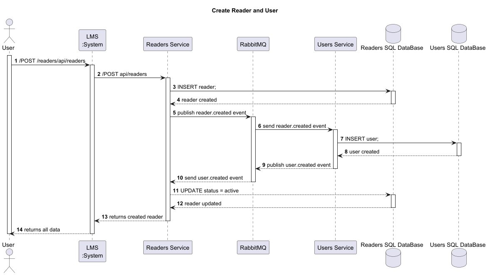
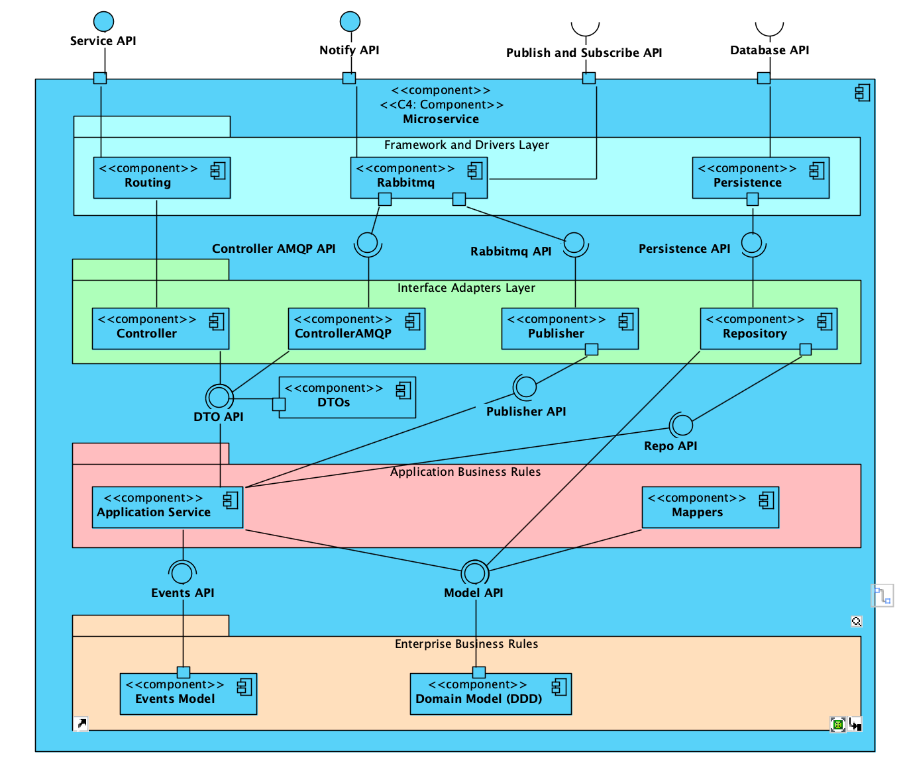

# Documentation Roadmap

## Index
- Level 1
    - Logical View
- Level 2
    - Logical View
    - Physical View
    - System Sequence Diagrams
- Level 3
    - Logical View
- QAS
- Technical Memos
- Microservice Patterns
- Monolith vs. Microservices: System Under Load

## Level 1

### Logical View

## Level 2

### Logical View

### Physical View

### System Sequence Diagrams

## Level 3

### Logical View

## QAS

[QAS.md](QAS/QAS.md)

## Technical Memos

[TechnicalMemos.md](TechnicalMemos.md)

## Microservice Patterns

[MicroServicePatterns.md](MicroServicePatterns.md)

## Monolith vs. Microservices: System Under Load

[LoadTestComparison.md](LoadTestComparison.md)

